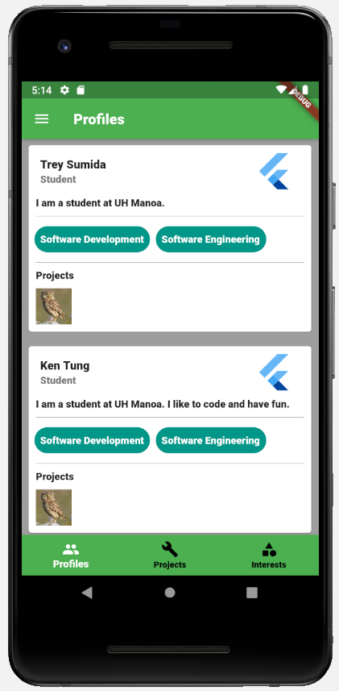
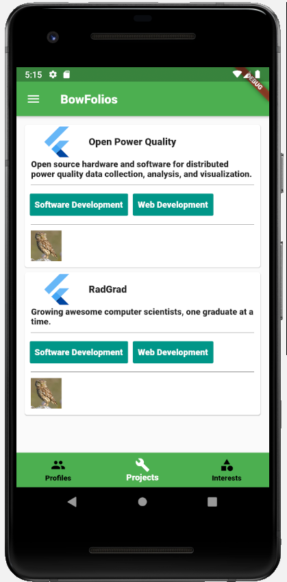
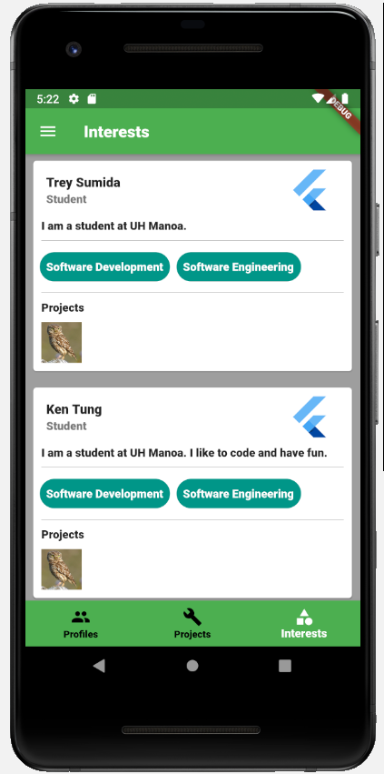
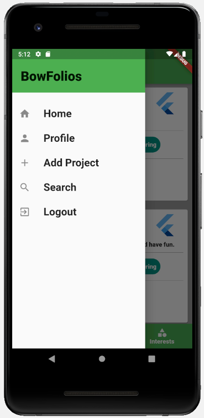

# Table of Contents
* [Overview](#overview)
* [Project Links](#links)
* [Project Milestones](#milestones)
* [User Guide](#guide)
* [Team Members](#members)

# Overview
BowFolios Mobile is an mobile app of the original BowFolios web application. Users have the ability to create a profile, add interests, and profiles. It provides the ability to view and modify profiles, projects, and interests. It is a quick way to find other UH Manoa students with the same interests and view their previous and current projects. 

For Milestone 1, we created the user interface for the login, create account, profiles, interests, projects, drawer navigation, and set up firebase for backend data storage and user authentication. Users can currently login, but not logout.

For Milestone 2, we plan to implement backend features to the profiles, interests, projects page, and implement a logout feature. We also want to route the widgets in the drawer navigation.

### Project Links
* [GitHub Project Board](https://github.com/yertnek/bowfolios/milestones)
* [GitHub Source Code](https://github.com/yertnek/bowfolios)

# Project Milestones
### [Milestone 1](https://github.com/yertnek/bowfolios/milestone/1)
The purpose of Milestone 1 is to have a partially working version of BowFolios.

### Milestone 2 (In Progress)
The purpose of Milestone 2 is to improve upon features made in Milestone 1. Main goal is to implement backend functionality in current pages and a logout feature.

# User Guide

### Profiles Page
The profiles page is presented to users when they first open the app. The profile page shows a list of users and the projects 
and interests associated with each specific user.

### Projects Page
The projects page shows a list of the projects and the users and interests associated with each specific project.

### Interests Page
The interests page shows a list of the interests and the users and projects associated with each specific interest.

### Drawer Navigation
The drawer navigation is used to redirect back home, the users profile page, the add project page, and the search page.

# Developer Guide
This section provides information on how to get the application to run on a developers local machine.

## Installation
First, 

# Team Members
* [Trey Sumida](https://github.com/trey-sumida)
* [Ken Tung](https://github.com/ken-10)

